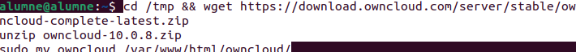

# Activitat 2: Owncloud

SMX-B MP08

####  Alumnes
* Marc Muria 
* Corneliu Miron

#### Professor
* Javier Sancho 

# Índex
##### Instalar Apache
##### Instalar MariaDB
##### Crear la base de datos de owncloud
##### Instalar PHP y sus módulos necesarios
##### Instalamos Owncloud
##### Configurar Apache
##### Acceder a Owncloud desde fuera de nuestro equipo

# Instalar Apache
##### Instalar el servidor Apache:

##### Desactivamos el listado de directorios del servidor:

# Instalar MariaDB

##### Instalamos MariaDB:   

##### Y configuramos la instalación:

##### Aquí es interesante:

* Deshabilitar usuarios anónimos.
* Deshabilitar acceso remoto como root.
* Eliminar las bases de datos de testeo y el acceso a las mismas.
* Actualizar las tablas de privilegios.

##### Por último reiniciamos el servidor MariaDB.

# Crear la base de datos de owncloud

##### Entramos en MariaDB:

##### Creamos la base de datos:

##### Creamos un usuario llamado ownclouduser con una contraseña que podría ser Admin1234.

##### Le damos acceso al usuario a la base de datos creada:

##### Aplicamos los cambios y salimos:

# Instalar PHP y sus módulos necesarios

##### Actualizamos los paquetes con el repositorio añadido:

##### Instalamos PHP y los módulos necesarios:

##### Hemos de tener en cuenta los requisitos de Owncloud antes de instalar los módulos.

##### Después de la instalación editamos el fichero php.ini y cambiaremos algunos valores:

##### Los valores que hemos de cambiar son los siguientes:
* file_uploads = On
* allow_url_fopen = On
* memory_limit = 256M
* upload_max_filesize = 100M
* display_errors = Off
* date.timezone = Europe/Madrid

# Instalamos Owncloud

##### Descargamos la última versión del programa y descomprimimos los ficheros, además movemos los archivos de Owncloud a "/var/www/html/owncloud".

##### Cambiamos propietario y permisos de los directorios de owncloud. www-data para que los pueda usar Apache, 755 para que los pueda ejecutar y leer cualquier usuario de Linux:

# Configurar Apache:

##### Vamos a configurar Apache:

##### Debemos dejar un fichero como el siguiente, pero cambiando el ServerName y el ServerAlias por los nombres y alias de nuestro propio dominio.

##### Habilitamos owncloud y el módulo rewrite:

##### Reiniciamos Apache:

